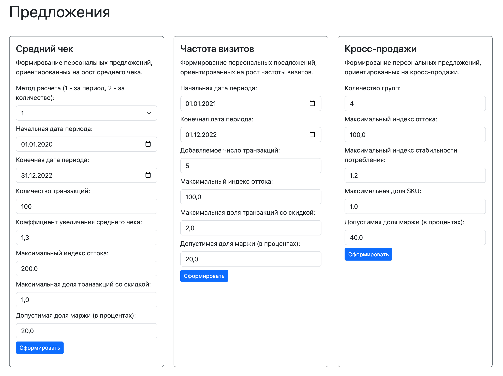

# Java_RetailAnalitycs

Java Web-приложение по аналитике розничных сетей, их анализ, статистика, сегментация клиентов и создание персональных предложений. Приложение реализовано на основе фреймворка **Spring** (**Boot**, **Web**, **MVC**, **Data JPA**, **Security**), **REST API**, **JDBC**, **Liquibase**, **PostgreSQL**, **Thymeleaf**, **Bootstrap**. В приложении предусмотрены 2 роли пользователей: *администратор* и *посетитель**. *Администратор* имеет полные права на редактирование и просмотр любой информации, запуск и остановку процесса обработки, осуществление CRUD-операций, импорт/экспорт таблиц из/в CSV файлы, выполнение служебных SQL-запросов. *Посетителю* доступен просмотр таблиц, формирование персональных предложений, экспорт таблиц в CSV формате.
Производится логирование всех действий пользователя при обращении к БД.

*в приложении предопределены пользователи: *администратор* (admin:111) и *посетитель* (user:123)

### Входные данные
#### Таблица Персональные данные
  - Идентификатор клиента
  - Имя
  - Фамилия
  - E-mail клиента
  - Телефон клиента
    
#### Таблица Карты
  - Идентификатор карты
  - Идентификатор клиента, одному клиенту может принадлежать несколько карт
    
#### Таблица Транзакци
  - Идентификатор транзакции
  - Идентификатор карты
  - Сумма транзакции в рублях (полная стоимость покупки без учета скидок)
  - Дата транзакции
  - Торговая точка
    
#### Таблица Чеки
  - Идентификатор транзакции
  - Позиция в чеке
  - Количество штук или килограмм
  - Сумма покупки фактического объема данного товара в рублях (полная стоимость без учета скидок и бонусов)
  - Фактически оплаченная сумма покупки данного товара, не включая сумму предоставленной скидки
  - Размер предоставленной на товар скидки в рублях

#### Таблица Товарная матрица
  - Идентификатор товара
  - Название товара
  - Группа SKU, идентификатор группы родственных товаров, к которой относится товар (например, одинаковые йогурты одного производителя и объема, но разных вкусов). Указывается один идентификатор для всех товаров в группе

#### Таблица Торговые точки
  - Торговая точка
  - Идентификатор товара
  - Закупочная стоимость товара
  - Розничная стоимость товара

#### Таблица Группы SKU
  - Группа SKU
  - Название группы

#### Таблица Дата формирования анализа
  - Дата формирования анализа
    
### Выходные данные
#### Представление Клиенты
  - Идентификатор клиента
  - Значение среднего чека
  - Сегмент по среднему чеку (Высокий, Средний, Низкий)
  - Значение частоты транзакций
  - Сегмент по частоте транзакций
  - Количество дней после предыдущей транзакции
  - Коэффициент оттока
  - Сегмент по коэффициенту оттока
  - Номер сегмента
  - Идентификатор основного магазина

#### Представление История покупок
  - Идентификатор клиента
  - Идентификатор транзакци
  - Дата транзакции
  - Группа SKU
  - Себестоимость
  - Фактически оплаченная стоимость
    
#### Представление Периоды
  - Идентификатор клиента
  - Идентификатор группы SKU
  - Дата первой покупки группы
  - Дата последней покупки группы
  - Количество транзакций с группой
  - Интенсивность покупок группы
  - Минимальный размер скидки по группе

#### Представление Группы
  - Идентификатор клиента
  - Идентификатор группы
  - Индекс востребованности
  - Индекс оттока
  - Индекс стабильности
  - Актуальная маржа по группе
  - Доля транзакций со скидкой
  - Минимальный размер скидки
  - Средний размер скидки

## Формирование персональных предложений, ориентированных на рост среднего чека

### Функция, определяющая предложения, ориентированные на рост среднего чека

Параметры функции:
- метод расчета среднего чека (1 - за период, 2 - за количество)
- первая и последняя даты периода (для 1 метода)
- количество транзакций (для 2 метода)
- коэффициент увеличения среднего чека
- максимальный индекс оттока
- максимальная доля транзакций со скидкой (в процентах)
- допустимая доля маржи (в процентах)

##### Определение условия предложения

1.  **Выбор метода расчета среднего чека.** Существует возможность
    выбора метода расчета среднего чека – за определенный период времени
    или за определенное количество последних транзакций. Метод расчета
    *вручную определяется* пользователем.

    -  Пользователь выбирает методику расчета **по периоду**, после чего
        указывает первую и последнюю даты периода, за который
        необходимо рассчитать средний чек для всей совокупности
        клиентов, попавших в выборку. При этом последняя дата
        указываемого периода должна быть позже первой, а указанный
        период должен быть внутри общего анализируемого периода. В
        случае указания слишком ранней или слишком поздней даты
        система автоматически подставляет дату, соответственно, начала
        или окончания анализируемого периода. Для расчета учитываются
        все транзакции, совершенные каждым конкретным клиентом в
        течение заданного периода.

    -  Пользователь выбирает методику расчета **по количеству последних
        транзакций**, после чего вручную указывает количество
        транзакций, по которым необходимо рассчитать средний чек. Для
        расчета среднего чека берется заданное пользователем
        количество транзакций, начиная с самой последней в обратном
        хронологическом порядке. В случае, если каким-либо клиентом из
        выборки за весь анализируемый период совершено меньше
        указанного количества транзакций, для анализа используется
        имеющееся количество транзакций.

2.  **Определение среднего чека.** Для каждого клиента определяется
    текущее значение его среднего чека согласно выбранному в рамках шага
    1 методу. Для этого общий товарооборот по всем попавшим в выборку
    транзакциям клиента делится на количество этих транзакций. Итоговое
    значение сохраняется в таблице как текущее значение среднего чека.

3.  **Определение целевого значения среднего чека.** Рассчитанное
    значение среднего чека умножается на коэффициент заданный пользователем. Получившееся значение сохраняется в системе
    как целевое значение среднего чека клиента и в дальнейшем
    используется для формирования условия предложения, которое должен
    выполнить клиент для получения вознаграждения.

##### Определение вознаграждения

4.  **Определение группы для формирования вознаграждения.** Для
    формирования вознаграждения выбирается группа, отвечающая
    последовательно следующим критериям:

    -   Индекс востребованности группы – максимальный из всех возможных.

    -   Индекс оттока по данной группе не должен превышать заданного пользователем значения. В случае, если коэффициент оттока превышает
        установленное значение, берется следующая по индексу
        востребованности группа;

    -   Доля транзакций со скидкой по данной группе – менее заданного пользователем значения. В случае, если для выбранной группы превышает
        установленное значение, берется следующая по индексу
        востребованности группа, удовлетворяющая также критерию по
        оттоку.

5.  **Определение максимально допустимого размера скидки для
    вознаграждения.** Пользователь вручную определяет долю маржи (в
    процентах), которую допустимо использовать для предоставления
    вознаграждения по группе. Итоговое значение максимально допустимой
    скидки рассчитывается путем умножения заданного значения на среднюю
    маржу клиента по группе.

6.  **Определение величины скидки.** Значение, полученное на шаге 5,
    сравнивается с минимальной скидкой, которая была зафиксирована для
    клиента по данной группе, округленной вверх с шагом в 5%. В случае,
    если минимальная скидка после округления меньше значения,
    получившегося на шаге 5, она устанавливается в качестве скидки для
    группы в рамках предложения для клиента. В противном случае данная
    группа исключается из рассмотрения, и для формирования предложения
    для клиента процесс повторяется, начиная с шага 4 (используются
    следующая подходящая по описанным критериям группа).

## Формирование персональных предложений, ориентированных на рост частоты визитов

### Функция, определяющая предложения, ориентированные на рост частоты визитов
Параметры функции:
- первая и последняя даты периода
- добавляемое число транзакций
- максимальный индекс оттока
- максимальная доля транзакций со скидкой (в процентах)
- допустимая доля маржи (в процентах)

##### Определение условия предложения

1. **Определение периода.** Пользователь вручную задает период действия разрабатываемого предложения, указывая первую и конечную его даты.

2. **Определение текущей частоты посещений клиента в заданный период.**
   Из конечной даты заданного периода вычитается первая дата,
   после чего полученное значение делится на среднюю интенсивность транзакций клиента.
   Итоговый результат сохраняется в качестве базовой интенсивности транзакций клиента в течение заданного периода.

3. **Определение транзакции для начисления вознаграждения.**
   Система определяет порядковый номер транзакции в рамках заданного периода, на которую должно быть начислено вознаграждение.
   Для этого значение, полученное на шаге 2, округляется согласно арифметическим правилам до целого,
   после чего к нему добавляется число транзакций, заданное пользователем.
   Итоговое значение является целевым количеством транзакций, которое должен совершить клиент для получения вознаграждения.

##### Определение вознаграждения

4.  **Определение группы для формирования вознаграждения.** Для
    формирования вознаграждения выбирается группа, отвечающая
    последовательно следующим критериям:

    -  Индекс востребованности группы – максимальный из всех возможных.

    -  Индекс оттока по данной группе не должен превышать заданного пользователем значения. В случае, если коэффициент оттока превышает
       установленное значение, берется следующая по индексу
       востребованности группа;

    -  Доля транзакций со скидкой по данной группе – менее заданного пользователем значения. В случае, если для выбранной группы превышает
       установленное значение, берется следующая по индексу
       востребованности группа, удовлетворяющая также критерию по
       оттоку.

5.  **Определение максимально допустимого размера скидки для
    вознаграждения.** Пользователь вручную определяет долю маржи (в
    процентах), которую допустимо использовать для предоставления
    вознаграждения по группе. Итоговое значение максимально допустимой
    скидки рассчитывается путем умножения заданного значения на среднюю
    маржу клиента по группе.

6.  **Определение величины скидки.** Значение, полученное на шаге 5,
    сравнивается с минимальной скидкой, которая была зафиксирована для
    клиента по данной группе, округленной вверх с шагом в 5%. В случае,
    если минимальная скидка после округления меньше значения,
    получившегося на шаге 5, она устанавливается в качестве скидки для
    группы в рамках предложения для клиента. В противном случае данная
    группа исключается из рассмотрения, и для формирования предложения
    для клиента процесс повторяется, начиная с шага 4 (используются
    следующая подходящая по описанным критериям группа).

## Формирование персональных предложений, ориентированных на кросс-продажи

### Функция, определяющая предложения, ориентированные на кросс-продажи (рост маржи)
Параметры функции:
- количество групп
- максимальный индекс оттока
- максимальный индекс стабильности потребления
- максимальная доля SKU (в процентах)
- допустимая доля маржи (в процентах)

Предложения, ориентированные на рост маржи за счет кросс-продаж,
подразумевают переключение клиента на максимально маржинальное SKU в
рамках востребованной им группы.

1.  **Выбор групп.** Для формирования предложений, ориентированных на
    рост маржи за счет кросс-продаж, для каждого клиента выбирается несколько
    групп (количество *задается* пользователем) с
    максимальным индексом востребованности, отвечающие следующим
    условиям:

    1.  Индекс оттока по группе не более заданного пользователем значения.

    2.  Индекс стабильности потребления группы составляет менее заданного пользователем значения.

2.  **Определение SKU с максимальной маржой.** В каждой группе
    определяется SKU с максимальной маржой (в рублях). Для этого по
    основному магазину клиента из розничной цены товара
    (`SKU_Retail_Price`) вычитается его закупочная стоимость
    (`SKU_Purchase_Price`) для всех SKU данной группы, представленных
    в магазине, после чего выбирается одно SKU с максимальным
    значением указанной разницы.

3.  **Определение доли SKU в группе.** Определяется доля транзакций, в
    которых присутствует анализируемое SKU. Для этого количество
    транзакций, содержащих данный SKU, делится на количество
    транзакций, содержащих группу в целом (за анализируемый период).
    SKU используется для формирования предложения только в том случае,
    если получившееся значение не превышает заданного пользователем значения.

4.  **Определение доли маржи для расчета скидки.** Пользователь *вручную
    определяет* долю маржи (в процентах), которую допустимо
    использовать для предоставления вознаграждения по SKU (задается
    единое значение для всей совокупности клиентов).

5.  **Расчет скидки.** *Заданное* пользователем на шаге 4 значение
    умножается на разницу между розничной (`SKU_Retail_Price`) и
    закупочной (`SKU_Purchase_Price`) ценой, а получившееся значение
    делится на розничную цену SKU (`SKU_Retail_Price`). Все цены – для
    основного магазина клиента. В случае, если получившееся значение
    равно или превышает минимальный размер скидки пользователя для
    анализируемой группы, округленной вверх с шагом в 5%, то в
    качестве скидки для данного SKU для клиента устанавливается
    минимальная скидка для группы, округленная вверх с шагом в 5%. В
    противном случае для клиента не формируется предложение по данной
    группе.

